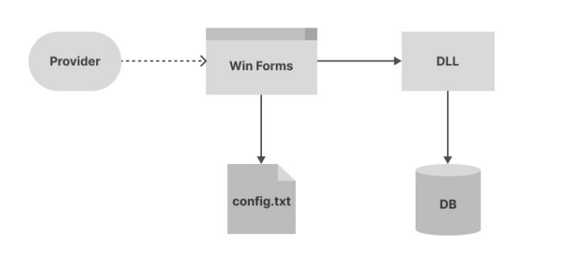

# Sistem za Internet i TV provajdere

Projektni zadatak obuhvata kreiranje **.NET biblioteke** i **grafičke aplikacije** za Internet i TV provajdere.

Biblioteku je potrebno kreirati kao **Class Library** projekat i eksportovati za korišćenje kao **DLL**, dok je grafičku aplikaciju potrebno kreirati kao **Windows Forms App** projekat koji će provajderu omogućiti da preko grafičkog interfeja koristi biblioteku.

  

## Opis zadatka

Provajder koristi grafičku aplikaciju kako bi upravljao **paketima** usluga koje **klijenti** koriste. Podaci o **klijentima** i **paketima** se čuvaju u bazi, i njima se može upravljati na sledeći način:
* Dodavanje novog paketa
* Dodavanje novog klijenta
* Aktiviranje željenog paketa za određenog klijenta 
* Deaktiviranje željenog paketa za određenog klijenta

Takođe, podaci se mogu čitati iz baze na sledeći način: 
* Čitanje liste svih registrovanih korisnika
* Čitanje liste svih kreiranih paketa
* Čitanje liste svih paketa koji su aktivirani za određenog korisnika 

Pored operacija sa podacima iz baze, treba omogućiti čitanje podataka iz **config.txt** fajla gde će se u prvoj liniji naći naziv provajdera koji koristi aplikaciju (npr. “SBB“) a u drugoj konekcioni string za povezivanje sa bazom tog provajdera. Ovaj fajl omogućava da više različitih provajdera koristi ovu istu aplikaciju bez ikakvih izmena, a da ipak koriste drugu bazu i imaju postavljeno svoje ime. 

### Baza

Podaci za **klijenta** koje treba čuvati u bazi su: **username**, **ime**, **prezime**

Postoji više tipova **paketa**, za svaki se u bazi čuvaju: **id**, **naziv**, **cena**. Dok se u zavisnosti od tipa paketa dodatno 
čuvaju sledeći podaci:
* broj kanala za TV paket
* brzina interneta za Internet paket
* tv paket id, internet paket id za Kombinovani paket

Potrebno je da biblioteka podržava konekciju sa **bar 2 različita tipa baze**, npr. SQLite i MySQL. U zavisnosti od konekcionog stringa aplikacija će se povezati sa određenom instancom odgovarajućeg tipa baze. 

### GUI (Graphical User Interface)

Windows Forms aplikacija treba da omogući sledeće funkcionalnosti: 
* Prikaz naziva provajdera
* Prikaz liste svih klijenata
* Prikaz liste svih paketa razdvojenih po tipu
* Označavanje paketa koji su aktivirani za izabranog klijenta
* Aktivacija i deaktivacija paketa za izabranog klijenta
* Dodavanje novog klijenta 

Primer GUI izgleda gde se vide tražene funkcionalnosti:

  

### Design Patterns - [Refactoring Guru](https://refactoring.guru/design-patterns/catalog)

U projektu je potrebno iskoristiti sledeće dizajn paterne:
* Creational patterns
	* Singleton
	* Od preostalih izabrati minimum **2**
* Structural patterns
	* Izabrati minimum 1 od: Adapter, Proxy, Decorator
	* Izabrati minimum 1 od: Bridge, Composite, Facade, Flyweight
* Behavioral patterns
	* zabrati minimum 2 od svih sem Iterator paterna

